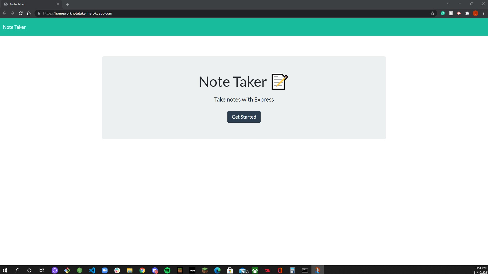
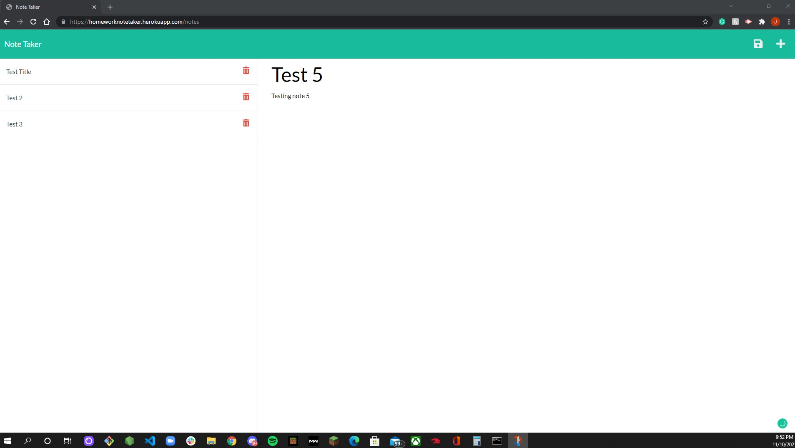

# Note-Taker

Heroku Deployed link: https://homeworknotetaker.herokuapp.com/

## Table of Contents

* [Description](#description)
* [Installation](#installation)
* [Usage](#usage)
* [Contribution](#contribution)
* [Test](#test)
* [License](#license)
* [Questions](#questions)

## Description
Note Taker is a simply app built with backend languages such as Express.js and Node. This app is designed to allow a user to make new notes, edit those notes and even delete notes after they have finished that task. 
## Installation
First you want to run npm install. Then run node index.js. After you run this, go to your browser and type in http://localhost:3001. From there, you will be able to run the app!
## Usage

## Contribution

## Test 

## License

## Questions
Email: 
elrodjosh96@gmail.com
Github Username:
elrodjosh96
